# La Vida del Boxeo — dirección de arte deportiva realista

Paquete visual v1 · bocetos del 7 de octubre; entrega del 8 de octubre de 2026.

Dirección elegida por el usuario: presentación deportiva realista, con personajes ficticios, para un juego de gestión de boxeadores y club. Menús modernos, retratos con carácter y un gimnasio de barrio que transmite progreso. La referencia de calidad es la presentación de los juegos deportivos de alto nivel; la marca y las composiciones de este paquete son propias.

Base de trabajo consultada: `main` en `914a1b415af3e62a1ec97e464ef9494783081494`, después de integrar R4.

## Cómo usar el paquete

1. Leer [GUIA_CODEX.md](GUIA_CODEX.md), especialmente las diferencias entre el boceto y las reglas del juego.
2. Abrir las imágenes de referencia y los dos fondos limpios. No convertir una captura de interfaz en una pantalla interactiva.
3. Consultar [design-tokens.json](design-tokens.json) para la dirección de color, escala y componentes.
4. Consultar [manifest.json](manifest.json) para dimensiones, peso, integridad y función de cada archivo. [PROMPTS.md](PROMPTS.md) registra los prompts disponibles.

Este cambio contiene diseño y documentación. No modifica producción, economía, persistencia, tests, dependencias ni publicación. Las imágenes son propuestas visuales: no prueban que la interfaz esté implementada y no sustituyen la evidencia R4.

## Marca y tono

Nombre: **La Vida del Boxeo**. Firma propuesta: **Carrera · Gimnasio · Legado**.

Base azul noche y carbón, texto marfil, acción principal ámbar y selección/foco cian. Fotografía ficticia con iluminación cálida, materiales del club y presentación limpia. Los personajes deben parecer deportistas y personas del barrio, con distintas edades adultas y constituciones. La riqueza visual acompaña las decisiones del manager.

La firma de estudio que aparece en algunas imágenes es un elemento del boceto, no una nueva razón social aprobada. El símbolo y el lettering de marca son exploraciones que deben reconstruirse como activos independientes si se adoptan.

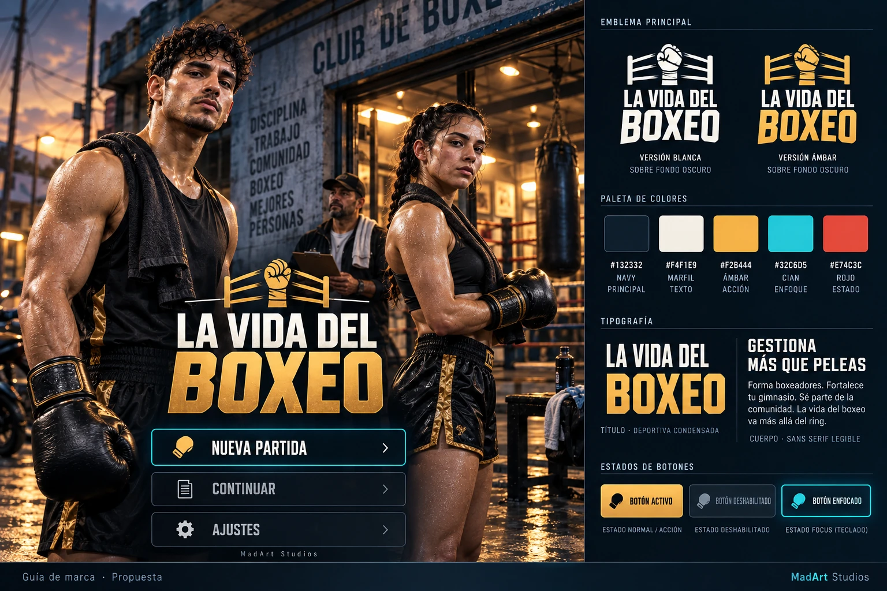

## Las siete pestañas

| Pantalla | Referencia | Aplicación prevista |
| --- | --- | --- |
| Ciudad | [01-ciudad](references/01-ciudad.webp) | Barrio con puntos seleccionables y detalle del inmueble. |
| Gimnasio | [02-gimnasio](references/02-gimnasio.webp) | Escena del club, boxeador seleccionado y estaciones accesibles. |
| Plantel | [03-plantel](references/03-plantel.webp) | Tarjetas, estados y acceso a la ficha y al historial. |
| Mercado | [04-mercado](references/04-mercado.webp) | Productos por categorías y detalle de compra. |
| Mi Perfil | [05-perfil](references/05-perfil.webp) | Carrera del manager y las tres ramas de cursos. |
| Personal | [06-personal](references/06-personal.webp) | Roles, requisitos, salarios y contratos existentes. |
| Calendario | [07-calendario](references/07-calendario.webp) | Agenda y operaciones ya presentes en el juego. |

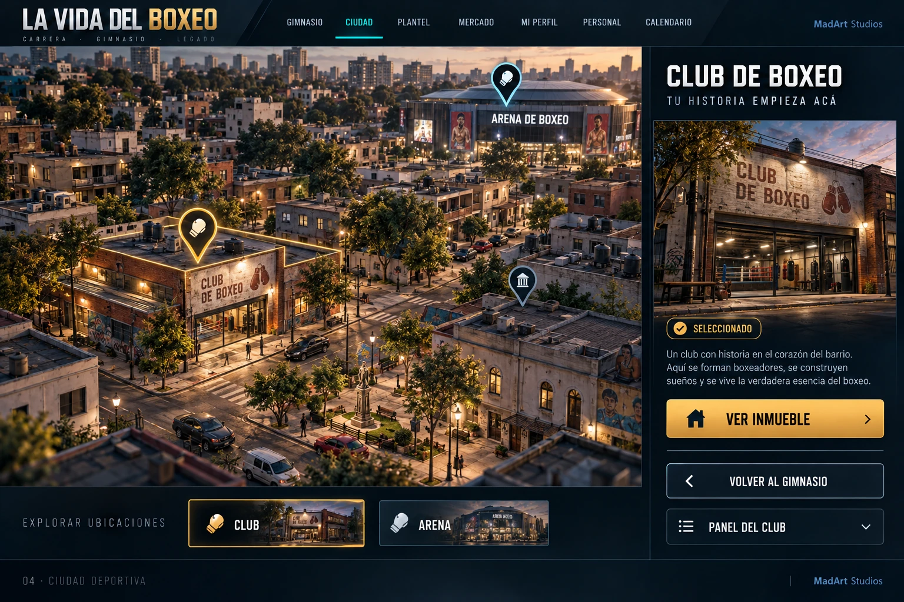

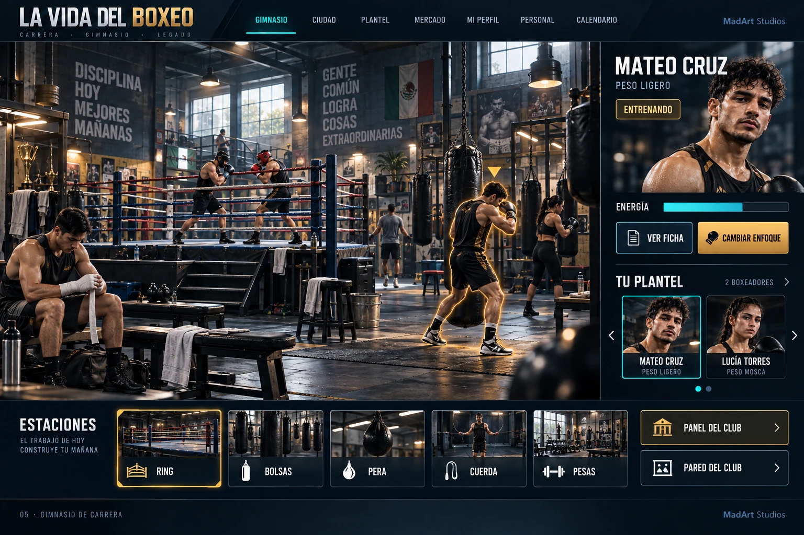

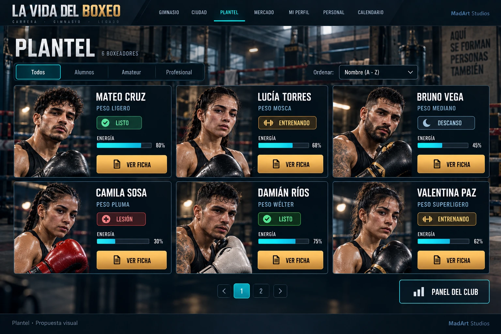

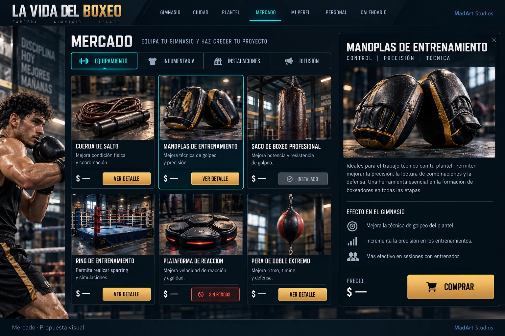

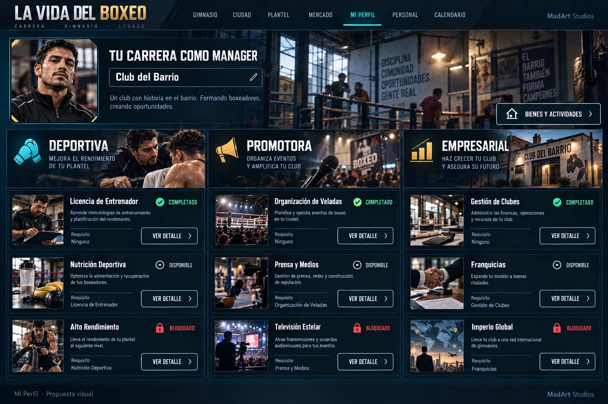

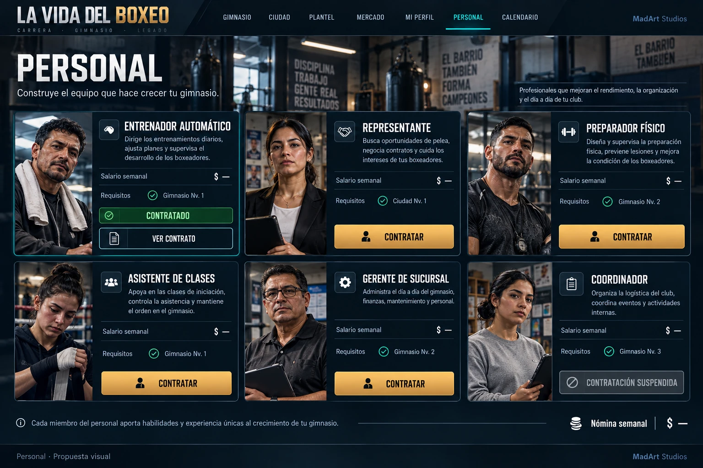

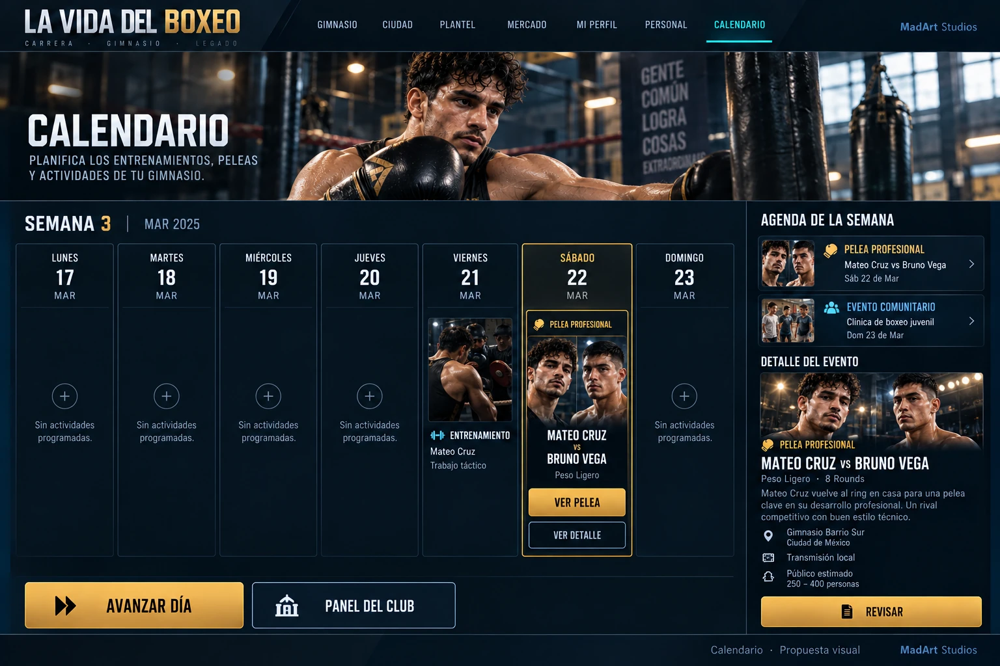

## Ficha, combate, ventanas y móvil

| Referencia | Uso |
| --- | --- |
| [08-ficha](references/08-ficha.webp) | Tres pilares y selección explícita entre los seis enfoques actuales. |
| [09-combate](references/09-combate.webp) | Presentación del enfrentamiento, descanso y resultado. |
| [10-dialogos](references/10-dialogos.webp) | Jerarquía visual de compra, transferencia, vencimiento y error. |
| [11-mobile](references/11-mobile.webp) | Reorganización móvil de escenas, plantel y ficha. |
| [12-retratos](references/12-retratos.webp) | Seis identidades ficticias como referencia de casting. |

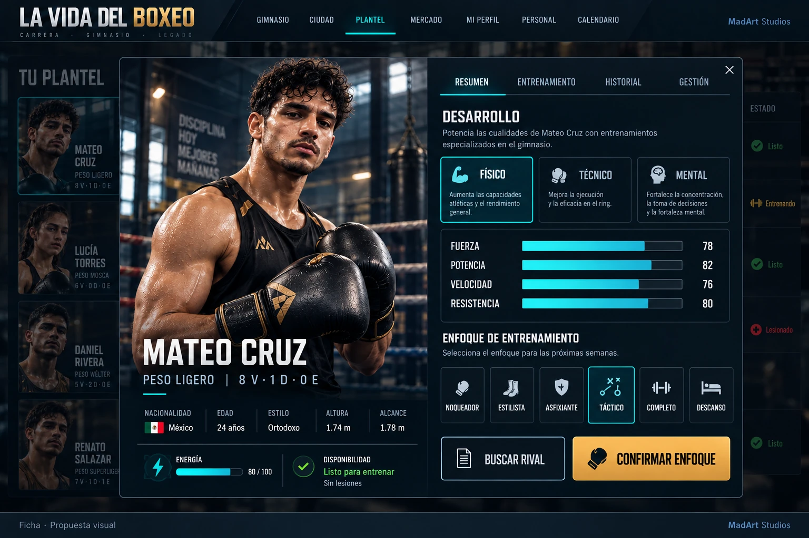

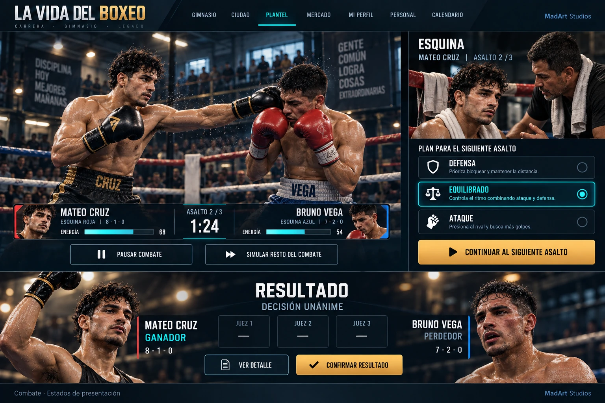

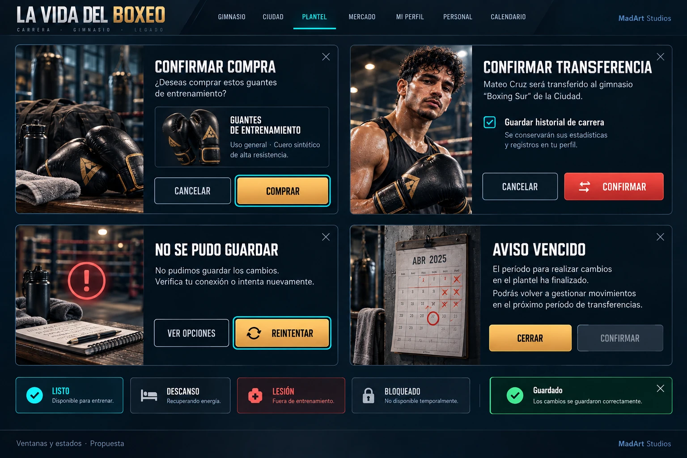

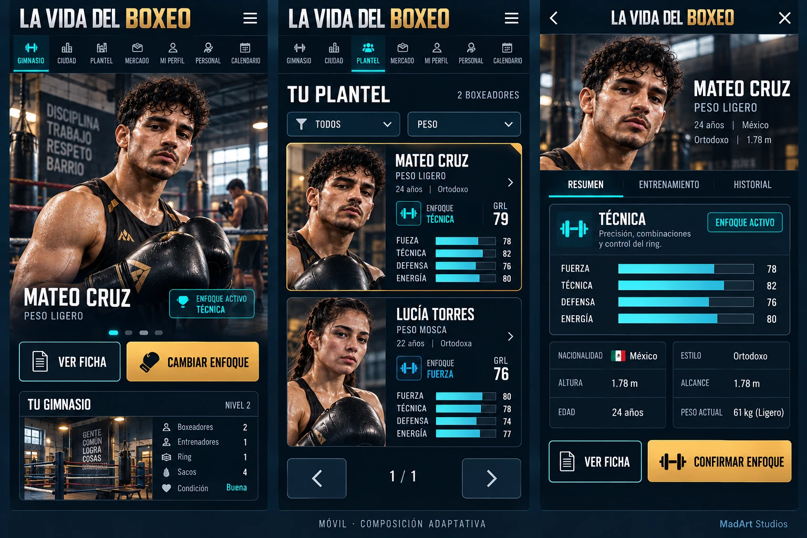

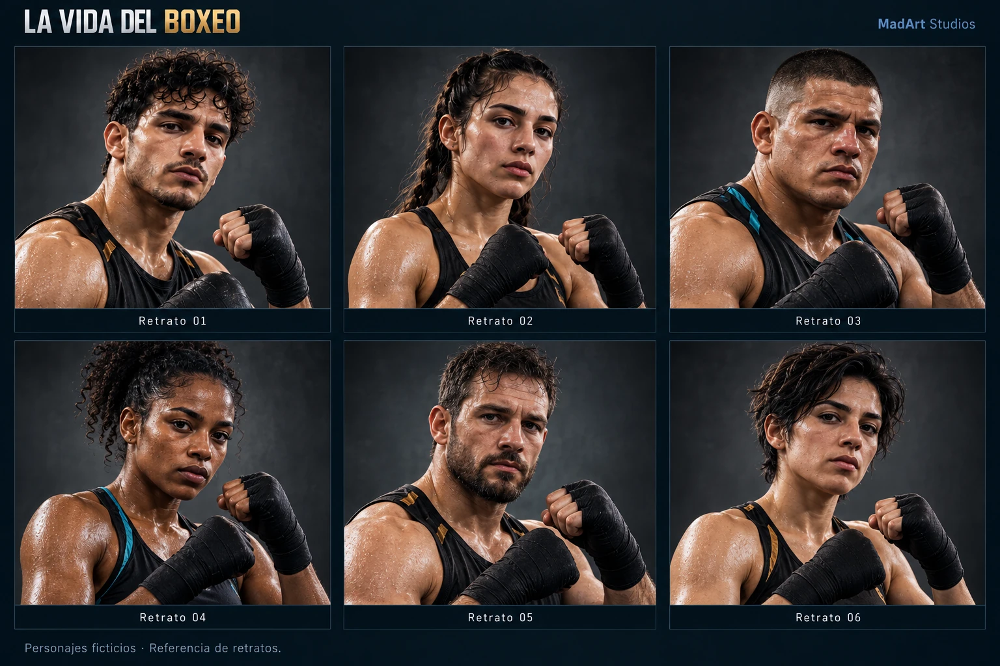

## Fondos limpios

Dos imágenes sin menús para explorar la integración de escenas. Son imágenes planas con perspectiva, no modelos 3D, capas de estaciones ni animaciones. La ciudad y el gimnasio tienen geometrías distintas a las imágenes de interfaz: ubicar los controles a partir de estos fondos, sin trasladar coordenadas de otra imagen.

- [13-city-background.webp](plates/13-city-background.webp): barrio, local, terreno, sucursal, vivienda, mansión y arena como lenguaje visual; los tipos y requisitos efectivos salen del modelo vigente.
- [14-gym-background.webp](plates/14-gym-background.webp): gimnasio vacío con ring y zonas de entrenamiento; no representa una distribución jugable ya implementada.

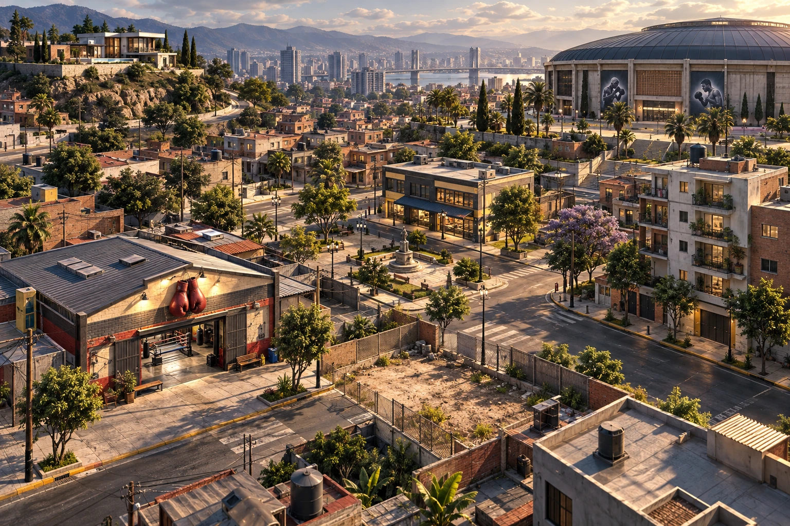

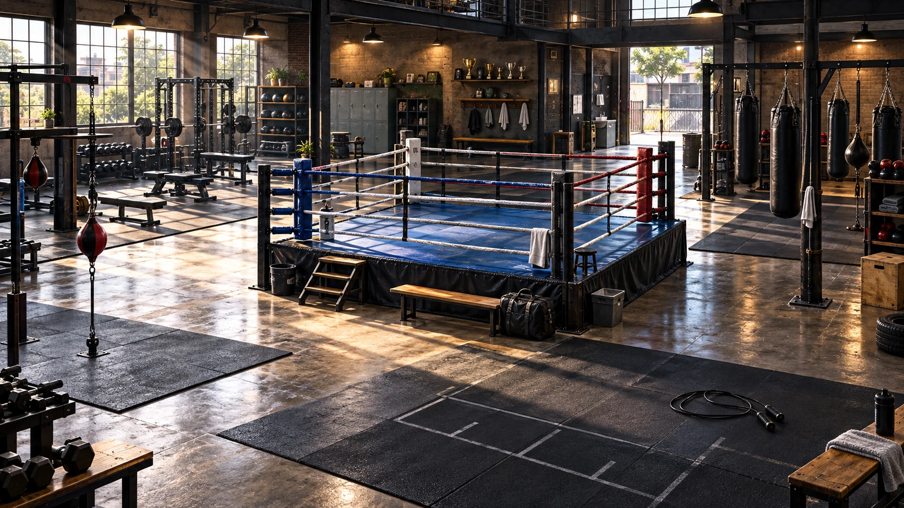

La [referencia inicial elegida](references/15-direccion-original.webp) se conserva para continuidad. Las variantes ilustradas o de otras paletas no forman parte de esta dirección.

## Alcance de la entrega

16 imágenes WebP: 14 láminas de referencia y 2 fondos limpios. Se conserva la resolución de cada original al convertir el formato. El catálogo de retratos es una lámina, no seis recortes transparentes terminados. Botones, textos, iconos y marca final deben producirse como elementos independientes; personajes animados y activos 3D requieren trabajo posterior.

Los textos y números dibujados son muestras. Algunos incluyen campos, requisitos o acciones que no existen en el juego: la guía enumera cómo tratarlos. Este paquete define la dirección de todas las pantallas principales, no un inventario de todos los activos finales del juego.
