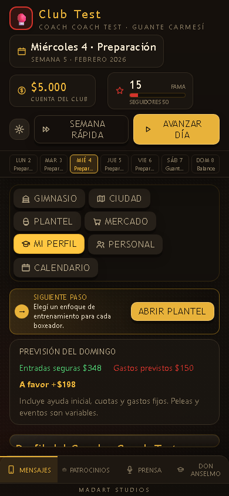
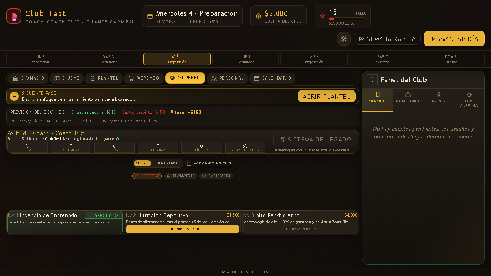

# Auditoría integral antes de BOX-15

**Proyecto:** La Vida del Boxeo · MadArt Studios\
**Fecha:** 2026-10-01\
**Checkout auditado:** `workspaces/phase-audit-hardening`\
**Dictamen:** NO aprobar todavía el candidato final. Reabrir los gates afectados antes de avanzar con nuevas funcionalidades de BOX-15.\
**Naturaleza del trabajo:** auditoría, no implementación. No se modificó código de producción ni se avanzó, borró o reemplazó la partida real.

## 1. Resumen para el propietario

El juego ha mejorado realmente: las grillas de escritorio, la navegación, el panel, el calendario y el recorrido normal de combate tienen pruebas que pasan. No hace falta descartar lo construido ni rediseñar todo.

Sin embargo, **73 tests aprobados no significan que todos los sistemas estén cerrados**. Esta revisión encontró contraejemplos reproducibles que la suite anterior no contemplaba:

1. Recargar un profesional recién promovido transforma sus 0 peleas profesionales en 50 e incorpora estadísticas amateur al circuito profesional.
2. Energía 0 se convierte en 100 al cargar; seguidores 0 se reconstruyen como 440 en el caso probado.
3. Semana rápida puede llegar al domingo dejando combates pendientes sin resolver.
4. Un boxeador lesionado puede hacer guanteos; alcanzar el indicador 10/10 no significa haber realizado diez sesiones reales.
5. Dos artículos nuevos cobran dinero, pero no aplican sus mejoras anunciadas.
6. El gerente de una sucursal puede bloquear la contratación de su entrenador local.
7. Las recompensas repetibles reutilizan metas ya cumplidas y generan nuevas recompensas sin progreso nuevo.
8. En móvil 390×844, el footer aparece, pero al contenido principal le quedan aproximadamente 24 px: las pestañas esenciales no resultan utilizables.

El siguiente paso debe ser corregir estas raíces con pruebas de regresión, no producir arte final ni volver a pedir al propietario que detecte los mismos defectos.

## 2. Alcance, evidencia y límites

### Qué se revisó

- Cinco documentos canónicos, contrato de canvas, plan vigente y evidencia de BOX-14; historial de auditorías como referencia, no como certificado vigente.
- Motor, reducer, tipos, contenido, guardado/migración, selección de rival, entrenamiento, guanteos, economía, tiempo, carrera e historial.
- Las siete pestañas, Panel del Club, ficha técnica, combate, modales, textos, estilos y mecanismos de paginación.
- Build, presupuesto, verificación estructural y configuración de publicación GitHub Pages.
- Pruebas automatizadas existentes y nuevas sondas de auditoría con datos sintéticos.

### Cómo leer los estados

| Estado | Significado |
|---|---|
| Reproducido | Un escenario ejecutado demostró el comportamiento defectuoso. |
| Confirmado por código | La rama y su consecuencia están identificadas; no se afirma haber reproducido toda la interacción humana. |
| Riesgo pendiente | Hay una ruta problemática identificada, pero falta una reproducción específica para cerrar el diagnóstico. |
| Diseño pendiente | Falta una definición o capacidad; no se presenta como función existente que se rompió. |
| PASS acotado | Pasó el escenario indicado, no todas las combinaciones posibles. |

No se hizo una certificación exhaustiva de cada combinación, una auditoría de seguridad de dependencias, una prueba con jugadores reales durante horas ni una nueva campaña completa de economía multi-semilla. La suite existente sí volvió a ejecutar sus simulaciones de larga duración. No se publicaron cambios ni se cambió el servidor de juego del propietario.

### Verificaciones realizadas en esta revisión

| Prueba | Resultado / alcance |
|---|---|
| `npm run verify` | PASS: 73/73 tests, TypeScript, build, presupuesto y auditoría estructural. |
| Build | JS 511,42 kB minificado; aviso de chunk >500 kB. Dentro del presupuesto: 499,4/560 KiB JS; 80,5/90 KiB CSS. |
| `git diff --check` | PASS; avisos de normalización CRLF, no errores de whitespace. |
| `scratch/integral_probes.audit.ts` | Sonda diagnóstica: reproduce fallos; su PASS confirma su existencia, NO su solución. Semilla base 441001. |
| `scratch/integral_browser_audit.py` | 7 pestañas × 4 viewports: 1280×720, 1366×768, 1024×768, 390×844. Sin excepciones JS ni respuestas HTTP ≥400 observadas. Detecta colapso móvil. |
| `scratch/run_multi_viewport_audit.py` | PASS: 16 combinaciones Plantel; 4/10 alumnos, mixto y 20 federados, paginación y retorno exacto. |
| `scratch/test_fight_and_market.py` | PASS: recorrido normal de 3 asaltos/resultado y navegación de categorías en 5 viewports de escritorio/ventana. |
| `scratch/test_profile_layout.py` | PASS geométrico en 5 viewports; no certifica legibilidad, simetría subjetiva ni móvil. |
| `scratch/test_box12_club_panel.py` | PASS: panel/dock, avisos y footer en 5 viewports, incluido móvil. No certifica las pestañas centrales móviles. |
| `scratch/test_box13_calendar.py` | PASS: agenda/eventos/cancelación y fechas del escenario en 5 viewports. |
| `scratch/test_box14_career.py` | PASS: pase profesional explícito y bloqueo de cupo. Falta roundtrip de guardado; A01 muestra por qué importa. |

Las pruebas de navegador sirven `dist` en puertos de auditoría y usan contextos independientes. No usan el almacenamiento de `localhost:3000` del propietario.

## 3. Pestaña por pestaña

| Pantalla | Lo comprobado que funciona | Lo que impide cerrarla |
|---|---|---|
| Gimnasio | Acceso al plantel, composición y footer de escritorio. | El estado visual de descanso no es autoridad: el guanteo puede ignorarlo. Selección por nombre en un helper, riesgosa con homónimos. Móvil colapsado. |
| Ciudad | Mapa/inspector/accesos, compra con requisitos, ranking separado. | Población rival sin renovación histórica; carrera/archivo incompletos; multi-sede no es un modelo real todavía. Móvil colapsado. |
| Plantel | Grilla adaptada, filtros/orden, distintivo de alta y paginación exacta; 10 por circuito. | Licencia/profesionalismo al recargar, sesiones reales, archivo de bajas y guía que puede retroceder. |
| Mercado | Catálogo/paginación y compra bloqueada sin fondos. | Artículos sin efecto real; descripciones y efectos requieren contrato completo. |
| Mi Perfil | Cursos/bienes organizados; actividades del club ubicadas aquí. | Tipografía muy pequeña y hueco visual en 1280×720; reconstrucción anuncia $900 aunque la base actual es $400; legado sin guarda de dominio. |
| Personal | Requisitos visibles, confirmación del déficit y estado contratado. | Entrenador local bloqueado por gerente; ojeador no mejora la búsqueda manual; automatización usa rival ajeno. |
| Calendario | Fecha civil y agenda/cancelación funcionan en fixtures normales. | Días de vencimiento no son días civiles; fechas libres/futuras no gestionables; semana rápida salta cartelera. |
| Panel del Club | Avisos limitados, canales separados, dock abre/cierra, consejos cobrados ocultos. | Metas repetibles sin nuevo progreso, evaluación tardía de hitos, prensa vieja repetida; accesibilidad de acciones. |
| Ficha técnica | Nombres de enfoques y formato `+ capacidad` corregidos; gestión/pase profesional. | Licencia redundante, recomendación distinta del DT, historial truncado y promesa falsa al transferir. |
| Combate | Controles accesibles y 3 asaltos normales pasan en escritorio. | Jueces, última caída, progreso al salir/recargar y autoridad del resultado necesitan corrección/pruebas. |
| Inicio/guardados/ajustes | Ranuras con nombre y envelope/migración existentes. | Validación parcial, ceros alterados, error de autosave sin aviso y política de cinco ranuras sin protección explícita. |

## 4. Registro de hallazgos y tests de aceptación

### A01 — P0 · La recarga altera la trayectoria profesional

**Reproducido.** `src/game/engine.ts:794`: `Number(campo) || fallback` trata 0 como ausencia. Un pugil con 50 amateurs, récord 32–18, 12 KO y 0 profesionales se carga con 50 profesionales, 32 victorias profesionales, 18 derrotas profesionales y 12 KO profesionales. Puede habilitar títulos indebidamente. El autosave puede persistir la alteración.

**Raíz/solución:** diferenciar campo ausente de cero explícito; migrar por versión, no inferir circuito a partir de un récord agregado ya separado.

**Test requerido:** aceptar pase → guardar → recargar → conservar 50 amateur/0 pro y todos los contadores; completar debut → repetir roundtrip. Fixtures antiguos sin campos se migran con política explícita, sin adjudicar amateur a pro.

### A02 — P1 · Energía y seguidores cero no sobreviven

**Reproducido.** `engine.ts:800` y `:885`: energía 0→100; seguidores 0→440 en la sonda. La recarga actúa como recuperación gratuita y modifica la comunidad.

**Solución:** normalización finita que preserve cero; separar default, reparación y límite. No cambiar campos válidos.

**Test:** 0/1/100, negativos, ausente, null, NaN e infinito; roundtrip sin cambio para valores válidos. No aceptar una pelea por recargar al pugil agotado.

### A03 — P0 · Semana rápida salta peleas pendientes

**Reproducido.** `state.tsx:479–505`. La guarda solo revisa si el estado de entrada YA es sábado. Desde viernes con pelea pendiente, Semana rápida ejecuta sábado y domingo; conserva la pelea sin resolver. El comando directo de avanzar tampoco bloquea sábado pendiente, aunque la UI normal sí lo bloquea.

**Solución:** transición única día a día que se detenga al llegar a una decisión obligatoria; reducer como autoridad. Considerar también la pelea creada por el representante al entrar al sábado.

**Test:** lunes/viernes/sábado, pelea manual/automática, una/varias peleas; nunca liquidar domingo mientras la cartelera de esa fecha siga pendiente. Tras resolver/cancelar, continuar una sola vez.

### A04 — P1 · Semana rápida puede repetir el sábado

**Reproducido.** Desde sábado sin pendientes, el comando vuelve a ejecutar `diaSabado`; suma otro guanteo. El atajo de Semana rápida admite ese día en `App.tsx`, aunque el botón no esté presente.

**Solución:** no ejecutar una etapa ya procesada; idempotencia del calendario, no solo guardas visuales.

**Test:** entrar sábado, registrar guanteos/entradas, activar atajo rápido y comprobar un único procesamiento. Repetir después de recargar.

### A05 — P1 · Diez puntos de práctica no equivalen a diez guanteos

**Reproducido.** `genPugilista` arranca `fogueo` en 0–3 y sesiones reales en 0. `diaSabado` añade 1–2 puntos, pero solo una sesión a `guanteosRealizados`. La licencia valida puntos. La sonda alcanzó 10/10 con 7 sesiones reales.

**Solución:** un contador de sesiones reales como fuente del requisito. Si alguien llega con experiencia previa, registrarla y explicarla explícitamente; no mezclar progreso acelerado con “10 sesiones”. Conservar sesiones posteriores a la licencia.

**Test:** 0/9/10/11 sesiones, incorporación, alumno que decide no licenciarse y profesional que sigue guanteando. UI, badge, comando y requisito coinciden.

### A06 — P1 · Guanteo ignora lesión, descanso y cartelera

**Lesión reproducida; resto confirmado por código.** `state.tsx:209–226`: filtros solo por espera/energía≥20; no excluyen lesión, enfoque descanso ni pelea oficial del mismo día. Un lesionado de mano participó y perdió energía.

**Solución:** selector único de disponibilidad para guanteo, distinto del de combate oficial, con reglas de recuperación y carga del día. No hacer sparring automático de un pugil en descanso médico.

**Test:** sano/lesionado/descanso/en espera, compañero único, pelea ese día y retorno tras recuperación. No usar la sesión extra para acelerar licencia de un lesionado.

### A07 — P1 · El DT utiliza el rival de otro pugil

**Reproducido.** `engine.ts:282`: toma `pendientes[0].rival` para todo el plantel. El boxeador B recibió Noqueador aunque su rival propio indicaba Táctico. `BoxerSheet.tsx:82` sí utiliza la pelea propia. Además, el consejo usa energía<35, mientras el DT descansa con energía<70 o lesión.

**Solución:** recomendación única por pugil y pelea propia, con prioridad médica común. El DT al contratar, al incorporar y al actualizar debe consultar esa misma regla.

**Test:** dos pugiles con rivales diferentes, sin rival, energía35/69/70, lesión y retorno. Ficha, badge y combo asignado coinciden sin depender del orden de cartelera.

### A08 — P1 · Mejoras comprables sin efecto

**Reproducido.** Cuerda de Velocidad ($700, +10% velocidad) y Plataforma de Reacción ($1.200, +10% defensa/eficacia) existen en `data.ts:128–129`, pero `calcularModificadores` no las interpreta. La sonda comprueba multiplicadores 1 en lugar de 1,1.

**Solución:** contrato declarativo de efecto; cada artículo debe demostrar efecto o declarar honestamente que es cosmético.

**Test:** parametrizar TODOS los artículos: comprar, conservar al recargar, aplicar efecto exacto, no duplicar compra/efecto. Mismo control para cursos, rasgos y personal.

### A09 — P1 · Entrenar puede reducir una capacidad

**Reproducido.** `engine.ts:309–313` aplica techo `talento+3` a la nueva suma. Potencia60/talento35 pasó a potencia38. Puede afectar guardados antiguos y valores generados con `vgBase`. Guanteo y descanso mental usan el mismo patrón de límite.

**Solución:** crecimiento no negativo; resolver incompatibilidad de atributos anteriores mediante migración informada, no mediante un entrenamiento que promete mejorar. Declive, si se diseña, es otra mecánica explícita.

**Test:** atributo bajo/en techo/sobre techo; entrenamiento y sparring nunca disminuyen por accidente; texto de subida corresponde al delta real.

### A10 — P1 · Bolsa mundial retenida en oferta sin título habilitado

**Reproducido.** `engine.ts:422–425`: sin curso TV, cambia título/etiqueta pero conserva campeón y bolsa internacional. La sonda obtuvo una “Pelea de experiencia” de $127.000 sin título. Puede desbalancear toda la economía.

**Solución:** construir una oferta realmente válida, o bloquear la oferta titular con el requisito. No degradar solo la etiqueta.

**Test:** cada nivel de título con/sin curso, debut pro, récord negativo y límite de experiencia; dinero, rival, título y explicación forman un único contrato.

### A11 — P1 · Gestión de sucursal depende del orden de contratación

**Reproducido.** `state.tsx:696`: la guarda del entrenador local cuenta gerentes/coordinadores. Con una sucursal y su gerente, contratar entrenador local se bloquea como si necesitara otra sucursal. Si se contrata antes, el recuento tampoco limita correctamente a entrenadores.

**Solución:** cupos independientes por puesto y asignación por sede; no reutilizar el cupo de administración para entrenamiento.

**Test:** gerente→entrenador y entrenador→gerente dan mismo resultado; coordinador, despido, puestos duplicados y salario/ingreso por sede conciliados.

### A12 — P1 · Transferencia promete conservar un historial que no archiva

**Reproducido para una baja sin criterio de leyenda.** `state.tsx:733–753` elimina el pugil; solo ciertos campeones/veteranos entran al Salón. `BoxerSheet.tsx:409` promete conservar su récord. El historial general guarda solo 12 resultados, no una ficha histórica completa. Se incumple la invariante canónica “Transferir no borra historia”.

**Solución:** archivo de carreras separado del Salón de la Fama, incluyendo todas las bajas competitivas; definir también alumnos sin licencia. El Salón es una selección, no el único almacén histórico.

**Test:** baja de debutante, campeón, alumno, pugil con pendiente; preservar datos y acceder al archivo tras recargar. Corregir además la notificación de espera: `!antes.includes(id)` elige activos anteriores, no el que salió de espera.

### A13 — P1 · Validación de guardado incompleta

**Reproducido para null en plantel; restantes confirmados por código.** `sanitizarEstado` lanza con un miembro null; eventos, comunitarios, cursos, lesiones, libro y estadísticas se aceptan parcialmente por cast. Días/cantidades pueden conservar fracciones o infinito. Pendientes no se filtran por pugil existente/ID único. Versión futura no se rechaza explícitamente; sanitización fija schema4.

**Solución:** validación recursiva por entidad y por versión; reparar de forma localizada, guardar original recuperable, diagnosticar y rechazar schemas futuros sin sobrescribirlos.

**Test:** corrupción aislada no borra plantel sano; IDs duplicados, pelea huérfana, tipos desconocidos, montos no finitos, arrays malformados, versión futura y migración idempotente. `guardar→cargar` conserva todo dato válido.

### A14 — P1 · Resultado y acciones especiales confían demasiado en el caller

**Confirmado por código.** `RESOLVER_PELEA` comprueba que exista pelea, pero confía en bolsa/fama/título/identidad del resultado y no exige fecha correcta. `LEGADO` no revalida requisito de título/fama en el reducer, aunque el botón se deshabilita. Salud para pactar no sustituye una validación al disputar.

**Solución:** comandos con autoridad de dominio: validar identidad, fecha, circuito, salud vigente y efecto permitido; resultado derivado de una sesión identificada. Revalidar legado y añadir confirmación informada antes de reemplazar carrera.

**Test:** resolver antes de fecha, resultado para otro pugil, título incompatible, doble pago, lesión adquirida tras agendar y legado sin requisito. No modificar historia/caja en intentos inválidos.

### A15 — P1 · Caídas sufridas suman al mérito del asalto

**Confirmado por código.** `engine.ts:551` incrementa `defensor.kdAsalto`; `cerrarAsalto:580–581` lo suma con +9 a sus propios puntos de mérito. Después se fuerza la tarjeta a 8/7. La penalización posterior no corrige que la comparación premie la caída sufrida; puede generar un ganador de mérito incoherente y una tarjeta 8–9 en ese camino.

**Solución:** distinguir caídas provocadas/sufridas y definir una única regla de puntuación consistente; no validar realismo reglamentario por el nombre “oficial”.

**Test:** A domina, B domina, una/dos caídas de cada lado, doble caída y asalto parejo. Simetría al intercambiar lados; nadie obtiene ventaja por sufrir una caída.

### A16 — P2 · Método de decisión mal nombrado

**Reproducido.** `engine.ts:630` llama unánime a cualquier victoria con al menos dos jueces y dividida a una derrota 0–3. Debe depender del consenso del lado ganador, no de si ganó el jugador.

**Test:** 3–0, 2–1, 2–0 con empate de un juez, 1–1 con empate, y lados invertidos. Definir cómo se nombran las decisiones mayoritarias antes de añadir el estado.

### A17 — Riesgo P0 · Última caída del asalto puede dejar la cola sin cierre

**Riesgo identificado por código; falta reproducción de navegador dirigida.** `FightScreen.tsx:115–167` retira el intercambio de la cola antes de entrar al conteo. Si es el último, al volver del conteo `consumirAcciones` encuentra cola vacía y retorna; no ejecuta `cerrarAsalto`. El recorrido normal aprobado no incluye este caso. La cola se simula completa antes de animarse: también debe comprobarse que no se muestra estado futuro antes del golpe correspondiente.

**Solución:** máquina explícita de estados con finalización independiente de la longitud de cola y snapshots de cada intercambio.

**Test:** caída en primer/último intercambio, recuperación al conteo, TKO, KO, ambos sin energía, simulación rápida desde pausa y todos los asaltos. El siguiente estado siempre es esquina o resultado, nunca espera vacía. Reabrir/recargar no permite reiniciar salud ni rerollear una pelea accidentalmente.

### A18 — P1 · Las pestañas centrales móviles colapsan

**Reproducido visualmente y por DOM.** 390×844: área principal 24,36 px; Mercado declara scroll interno de contenido ~806 px contra 24 px disponibles; Ciudad ~234 px. `overflow-hidden` corta contenido esencial. Ver footer no demuestra visibilidad del juego.

**Solución:** presupuesto vertical mobile propio: cabecera resumida, navegación compacta y ayudas plegables/contextuales. Paginación adecuada al área REAL; no minificar toda la UI ni duplicar indicadores para ocuparla.

**Test:** todas las pestañas y acciones principales en 390×844, móvil bajo/horizontal, onboarding activo/completo, panel abierto/cerrado y nombres largos. Footer + área útil mínima + CTA alcanzable + legibilidad, no solo altura del documento.

### A19 — P2 · Geometría aprobada con tipografía demasiado pequeña

**Confirmado por CSS y captura.** En 1280×720, Mi Perfil tiene gran separación entre navegación de ramas y tarjetas, mientras controles/textos se reducen hasta .5rem/.53rem en reglas de altura. Hay reglas repetidas y `!important`; algunas ocultan encabezados. Contradice la biblia: no reducir letras para forzar contenido.

**Solución:** tokens de tamaño mínimo, retícula por contenido/área, densidad adaptativa y detalle accesible; unificar breakpoints y retirar parches superpuestos.

**Test:** centrado óptico icono/texto, alturas y CTA homogéneos; texto principal legible a zoom125%; nada esencial desaparece por una media query. Captura debe complementar la medida geométrica.

### A20 — P2 · Modales y acciones no garantizan teclado accesible

**Confirmado por código.** `Modal` tiene role/aria-modal, pero no enfoque inicial, trap/restauración, fondo inert ni Escape propio. `modal-title` es un ID fijo para modales simultáneos. Escape global de App no cierra todos los modales internos. Algunas acciones del panel son div clickeables; ayudas basadas solo en title no resuelven móvil.

**Solución:** primitiva compartida de diálogo y botones semánticos, detalles accesibles por teclado/táctil y feedback anunciado.

**Test:** Tab/Shift+Tab nunca sale del modal; Escape cierra el correcto; al cerrar vuelve al disparador; pantalla lectora identifica título; ninguna acción depende solo de hover. No afirmar accesibilidad completa por tener un aria-label.

### A21 — P1 · Anselmo puede recompensar continuamente el mismo logro

**Reproducido.** `state.tsx:127–147` y `:864–879`: c8+ repite tres metas absolutas sin nueva baseline. Con 3 recreativos, 1.500 seguidores y 3 victorias ya conseguidos, veinte ciclos produjeron 27 consejos históricos, cobrables sin nuevos logros. La lista crece sin archivo/límite. El reemplazo existe, pero no aporta progresión nueva.

**Solución:** objetivos declarativos con umbral creciente o delta desde aceptación, recompensas acotadas y archivo. Evaluar al ocurrir la acción relevante, no solo al cerrar domingo.

**Test:** cobrar→nuevo objetivo no satisfecho por el mismo pasado; reentrada, reload y doble clic no pagan dos veces; nueva meta progresa razonablemente durante 120 semanas.

### A22 — P2 · Dos relojes y plazos que no son días reales

**Reproducido.** En semana49, `mes/anio` ya indica2027, pero fecha civil sigue en2026; se envejece por 48 semanas. `venceEn` solo disminuye en días de gestión: un aviso con “1 día” el viernes sigue con1 el lunes.

**Solución:** fecha absoluta única para agenda, cumpleaños, vencimientos y ciclos económicos; adaptar/migrar campos antiguos. Si se desea “días de gestión”, nombrarlo así, no como días civiles.

**Test:** fin de mes/año, febrero, viernes→lunes, avances rápidos y reload; misma fecha/edad/plazo en todas las vistas.

### A23 — P2 · Guía inicial confunde enfoque completo con ausencia de decisión

**Confirmado por código.** `App.tsx:119–151` usa `combo !== acondicionamiento` como indicador de enfoque elegido. Elegir conscientemente Completo nunca completa el paso; un alumno nuevo puede reabrir toda la guía. Si todos pasan a boxeadores, no quedan alumnos y el primer paso vuelve a falso. La lista desaparece por semana1, no por un hito persistente.

**Solución:** progreso de onboarding explícito/persistente, separado del combo actual y las necesidades de una nueva incorporación.

**Test:** elegir cada uno de los seis enfoques, incorporar alumno, licenciar a todos, transferir al primero y recargar. La guía completada no retrocede; el nuevo alumno conserva su aviso individual.

### A24 — P2 · Economía conciliada no equivale a economía totalmente conectada

**Confirmado por código/diseño pendiente.** Libro semanal y préstamo tienen pruebas útiles, pero previsión/liquidación duplican lógica. “Entradas seguras” incluye promedio de una actividad aleatoria. Todos los retornos sociales mínimos superan la inversión. Se puede programar velada sin combates; se debe decidir si es una exhibición válida o ingreso sin contraprestación. Arena promete eliminar alquiler, pero el gasto solo comprueba propiedad local. Mi Perfil anuncia reconstrucción con$900, mientras `crearEstadoBase` tiene$400.

**Solución:** liquidación/proyección desde transacciones tipadas y reglas únicas; distinguir garantizado/estimado, aplicar efectos prometidos, definir riesgo y requisitos de actividades/veladas. Corregir importes visibles derivados de config.

**Test:** cada ingreso/gasto, préstamo, devolución, sucursal, sponsor, recaudación y cierre; misma fórmula en previsión/caja/libro. Caja negativa no causa softlock sin salida documentada. No introducir rescates ni riesgo nuevos sin aprobar balance.

### A25 — P2 · Población, títulos y sedes no están cerrados como carrera larga

**Diseño pendiente/confirmado por estructura.** Rivales de ranking persistentes no reciben una vida competitiva/renovación equivalente a ofertas generadas de nuevo. `tituloAspirable` evalúa el mayor título elegible primero: puede saltar niveles, sin condición de ranking. Sucursal es un ID de propiedad no repetible; no hay entidad sede/asignación de pugil/equipo/empleado. Cupos10+10 son globales, frente al canónico “por sede”.

**Solución:** definir el alcance del MVP explícitamente; separar carrera rival, oferta y campeón; modelo de sede antes de prometer varias sedes independientes. No añadir Unreal ni assets para resolver estos contratos.

**Test:** campeón/defensa/título perdido, carrera mala, retiro/generación de rivales y crecimiento limitado; 120+ semanas con identidad/records coherentes. Si se difiere, la UI y documentación lo declaran.

### A26 — P1 frente al contrato de traducción · No hay catálogo completo de textos

**Confirmado por código.** `src/i18n/index.ts` ofrece idiomas y formato Intl, pero no `t`, catálogos ni claves de contenido. UI/reducer/datos contienen español y textos persistidos; `fmt` y seguidores fuerzan es-AR. No hay traducción completa ni preparación completa demostrada.

**Solución:** inventario y claves, mensajes/eventos guardados como IDs/parámetros, formato desde locale y migración de textos antiguos. No mostrar un idioma como disponible si la experiencia queda parcialmente traducida.

**Test:** todo texto visible, tooltips, errores, overlays y plurales; pseudo-localización +40%, inglés/portugués y nombres propios preservados. Ninguna regla compara conceptos traducidos: hoy “Desembolso del préstamo” sí interviene en estadísticas operativas.

### A27 — P2 · Los gates automáticos dejan falsos positivos

**Confirmado.** `audit_engine.js` valida existencia y cadenas, no reglas de juego. Los E2E viven en scratch, no en `npm run verify` ni CI. El fixture compartido utiliza campos obsoletos y no define talento, por lo que la sanitización asigna talento0; incluye récord y cantidades inconsistentes. Sus pruebas son geométricas, no carreras válidas. Footer visible permitió aprobar panel/calendario mobile sin medir contenido central utilizable.

**Solución:** fixtures canónicos tipados, pruebas en suites permanentes/CI, aserciones negativas y pruebas de roundtrip; separar gates de geometría, legibilidad, accesibilidad y regla. Semillas e invariantes variadas, no solo curvas exactas de caja.

**Test:** los contraejemplos de esta auditoría primero fallan como tests de aceptación; tras corregir pasan junto a suites anteriores. Un fallo esencial devuelve exit1. Incluir paths de KO/caída y estado móvil completo.

### A28 — P2 · Documentación y guardado operacional requieren reconciliación

**Confirmado por código/documentación.** Hay estados canónicos antiguos con36/42/53tests y varias generaciones de planes; BOX-14 especifica una aprobación acotada, no integral. No hay un registro único que vincule todos los hallazgos a solución/prueba vigente. `GameProvider` ignora el false de autosave; escribir ranuras y autosave no es atómico; al superar cinco ranuras se trunca sin protección explícita. Error de almacenamiento no se anuncia. Recargar domingo elimina resumen (sí deja botón de nueva semana, por lo que no se certifica como bloqueo).

**Solución:** índice rector único y ledger de hallazgos con estados; guardado con éxito real/aviso, copia segura y política de ranuras. Definir acciones permitidas después de liquidar domingo y reconstruir su resumen desde datos válidos, sin duplicar caja.

**Test:** almacenamiento lleno/denegado, falla entre escrituras, cinco/seis ranuras, save domingo y combate, backup corrupto, reintento y acciones posteriores al cierre. Nunca informar guardado exitoso cuando falló.

## 5. Por qué aparecieron fallos pese a las auditorías anteriores

No hay una única explicación; se observan cuatro causas transversales:

1. **UI y dominio no comparten toda la autoridad.** El botón bloquea avanzar, pero el comando permite hacerlo; ficha y DT calculan con rivales distintos.
2. **Se validó una transición sin su persistencia.** El pase profesional en pantalla funciona; al cargar cambian los contadores.
3. **Se probó apariencia geométrica, no usabilidad íntegra.** Ver footer y no tener scroll global dejó pasar un canvas central de24px.
4. **Contenido agregado sin contrato ejecutable.** Dos equipos anuncian efectos no conectados; metas nuevas no exigen progreso nuevo.

Además, el motor (~902 líneas), reducer/persistencia (~990) y paneles (~876) concentran responsabilidades. No es necesario reescribir todo: hay que extraer gradualmente las reglas críticas y prohibir segundas implementaciones del mismo cálculo.

## 6. Orden recomendado de corrección antes de BOX-15

No propongo otra ronda indefinida de auditorías generales. Esta auditoría deja una baseline y **cinco gates de reparación y reauditoría focalizada**, reutilizando lo que ya pasa:

| Gate | Orden y alcance | Condición para avanzar |
|---|---|---|
| R1 — Partidas/carrera | A01, A02, A12, A13, A28 guardado. | Ningún dato válido cambia en roundtrip; backup y archivo seguros; schemas incompatibles no se sobrescriben. |
| R2 — Tiempo/salud/combate | A03–A07, A09, A14–A17, A22. | Cartelera no se salta; sesión única; diez sesiones reales; lesión respetada; cada combate siempre termina. |
| R3 — Contenido/economía | A08, A10, A11, A21, A24. | Efectos y bolsas correctos; contratación independiente del orden; recompensas exigen progreso; caja/libro conciliados. |
| R4 — Canvas/texto/accesibilidad | A18–A20, A23, A26. | Todas las pestañas utilizables en móvil/desktop/zoom; botones y textos legibles; idioma y foco completos para el alcance habilitado. |
| R5 — Integración/horizonte | A25, A27, A28 documentación. | Casos diferidos explicitados; matriz completa y simulaciones multi-semilla sin P0/P1; único informe vigente. |

Cada gate sigue: reproducir → test que falla → solución mínima → test verde → regresión cruzada → documento actualizado. No pasar al siguiente por haber añadido código ni por el número de tests.

### Checklist de cierre integral

- [ ] A01–A28 tienen responsable, estado, alcance y evidencia; riesgos no se convierten en PASS por falta de reproducción.
- [ ] Guardado probado justo después del pase profesional, combate, compra, reward y balance.
- [ ] Día normal, rápido y atajo comparten las mismas guardas.
- [ ] Todos los equipos/rasgos/cursos/personal cumplen sus efectos anunciados.
- [ ] KO, TKO, empate, decisiones y última caída tienen E2E específicos.
- [ ] Onboarding, consejo y automatización no contradicen el estado real.
- [ ] 7 pestañas × estados vacío/normal/máximo × resoluciones objetivo; acciones alcanzables y lectura suficiente.
- [ ] Zoom125%, nombres largos, idiomas expandidos, teclado y errores de almacenamiento probados.
- [ ] 12/52/120 semanas multi-semilla, derrotas, lesión, deuda, staff, títulos y reload intercalado.
- [ ] CI ejecuta regresiones relevantes; reportes distinguen PASS de pendiente y limitación.
- [ ] Cero P0/P1 y ningún P2 contrario a requisito explícito antes de pedir el playtest final al propietario.

## 7. Evidencia visual

### Móvil: footer visible, pestaña inutilizable



### Escritorio: contenido accesible, pero legibilidad/distribución pendientes



Las imágenes son evidencia de fixtures aislados, no capturas de la partida real. Abrirlas desde el repositorio si el visor Markdown no resuelve rutas relativas.

## 8. Cómo repetir la revisión

Desde el checkout auditado:

```text
npm run verify
npx vitest run --config scratch/audit-vitest.config.mjs --disableConsoleIntercept --reporter=verbose
python scratch/integral_browser_audit.py
python scratch/run_multi_viewport_audit.py
python scratch/test_fight_and_market.py
python scratch/test_profile_layout.py
python scratch/test_box12_club_panel.py
python scratch/test_box13_calendar.py
python scratch/test_box14_career.py
```

Python/Playwright deben estar disponibles en el entorno que ejecute estas pruebas; hoy no son una dependencia reproducible declarada de CI. Las sondas `integral_probes.audit.ts` afirman el comportamiento defectuoso observado: convertirlas a tests de aceptación antes de corregir, no incorporarlas a CI como si su PASS aprobara el producto.

## 9. Decisión

**La auditoría integral queda entregada; el juego no queda certificado como candidato final.** Hay avances comprobados que se conservan y raíces concretas que deben corregirse. Recomiendo comenzar R1 (guardado/carrera), luego R2 (tiempo/salud/combate), y retomar BOX-15 con este registro como entrada obligatoria. Arte final, Unreal, cuentas online y monetización quedan fuera de esta reparación.
